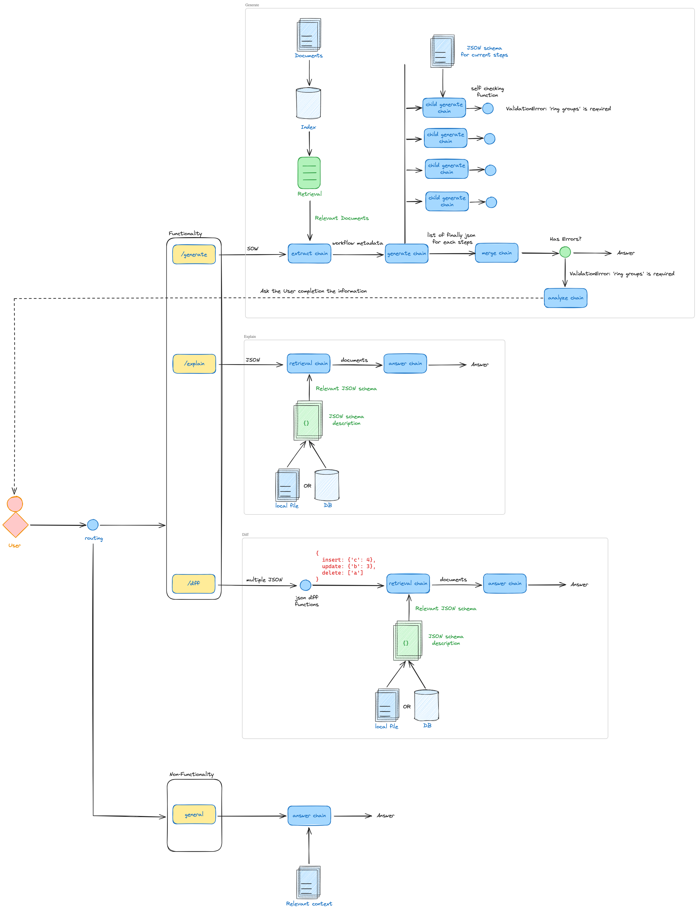

# 🦜️🔗 ChatterBox power by LangChain


## ✅ Running locally
1. Install backend dependencies: `poetry install`.
1. Make sure to enter your environment variables to configure the application:
```
export OPENAI_API_KEY=
export WEAVIATE_URL=
export WEAVIATE_API_KEY=
export RECORD_MANAGER_DB_URL=

# for tracing
export LANGCHAIN_TRACING_V2=true
export LANGCHAIN_ENDPOINT="https://api.smith.langchain.com"
export LANGCHAIN_API_KEY=
export LANGCHAIN_PROJECT=
```
1. Run `python backend/ingest.py` to ingest LangChain docs data into the Weaviate vectorstore (only needs to be done once).
   1. You can use other [Document Loaders](https://python.langchain.com/docs/modules/data_connection/document_loaders/) to load your own data into the vectorstore.
1. Start the Python backend with `make start`.
1. Install frontend dependencies by running `cd ./frontend`, then `yarn`.
1. Run the frontend with `yarn dev` for frontend.
1. Open [localhost:3000](http://localhost:3000) in your browser.

## 📚 Technical description

There are two components: ingestion and question-answering.

Ingestion has the following steps:

1. Pull html from documentation site as well as the Github Codebase
2. Load html with LangChain's [RecursiveURLLoader](https://python.langchain.com/docs/integrations/document_loaders/recursive_url_loader) and [SitemapLoader](https://python.langchain.com/docs/integrations/document_loaders/sitemap)
3. Split documents with LangChain's [RecursiveCharacterTextSplitter](https://api.python.langchain.com/en/latest/text_splitter/langchain.text_splitter.RecursiveCharacterTextSplitter.html)
4. Create a vectorstore of embeddings, using LangChain's [Weaviate vectorstore wrapper](https://python.langchain.com/docs/integrations/vectorstores/weaviate) (with OpenAI's embeddings).

Question-Answering has the following steps:

1. Given the chat history and new user input, determine what a standalone question would be using GPT-3.5.
2. Given that standalone question, look up relevant documents from the vectorstore.
3. Pass the standalone question and relevant documents to the model to generate and stream the final answer.
4. Generate a trace URL for the current chat session, as well as the endpoint to collect feedback.

## Documentation

Looking to use or modify this Use Case Accelerant for your own needs? We've added a few docs to aid with this:

- **[Concepts](./CONCEPTS.md)**: A conceptual overview of the different components of Chat LangChain. Goes over features like ingestion, vector stores, query analysis, etc.
- **[Modify](./MODIFY.md)**: A guide on how to modify Chat LangChain for your own needs. Covers the frontend, backend and everything in between.
- **[Running Locally](./RUN_LOCALLY.md)**: The steps to take to run Chat LangChain 100% locally.
- **[LangSmith](./LANGSMITH.md)**: A guide on adding robustness to your application using LangSmith. Covers observability, evaluations, and feedback.
- **[Production](./PRODUCTION.md)**: Documentation on preparing your application for production usage. Explains different security considerations, and more.
- **[Deployment](./DEPLOYMENT.md)**: How to deploy your application to production. Covers setting up production databases, deploying the frontend, and more.